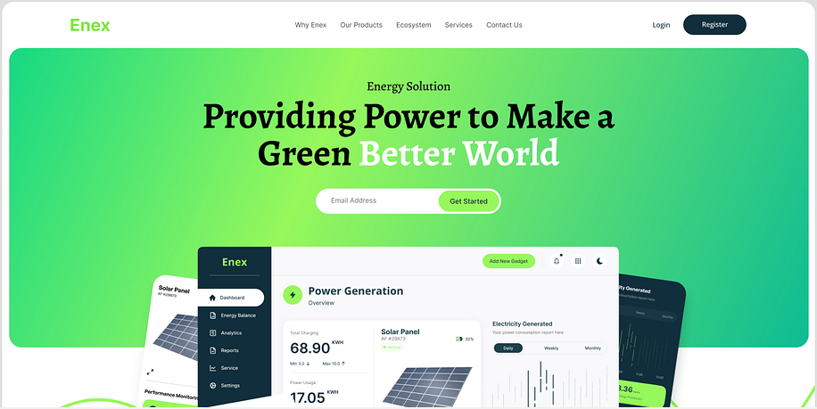

# voyage-project-tier2-solar-panel-planner

## Table of Contents

* [Overview](#overview)
* [General Instructions](#general-instructions)
* [Requirements & Specifications](#requirements-specifications)
* [Acknowledgements](#acknowledgements)
* [About Chingu](#about-chingu)

## Overview

Welcome, Chingus!

The city of Los Angeles is encouraging residents to install private solar panels as part of a local initiative to combat global warming. This project provides a free service where a city-hired specialist evaluates the installation and maintenance costs of solar panels. The initial MVP is a web-based application enabling residents to schedule appointments and allowing city employees to manage and plan these visits effectively.

In this voyage, your team will create a user-friendly solar panel planning application that simplifies the process of scheduling evaluations. Get ready to combine your problem-solving skills and creativity to build a tool that makes solar panel installation and maintenance planning a breeze!

The application supports two main roles:

**Resident:** Can request an appointment for a solar panel evaluation by submitting their contact details, address, and preferred timeslot.

**City Hall Employee:** Can access appointment requests, generate visit schedules for specialists, and export planning details in a downloadable/printable format.

## General Instructions

This project is designed to be worked on by a team rather than an individual
Chingu. This means you and your team will need to thoroughly read and
understand the requirements and specifications below, **_and_** define and
manage your project following the _Agile Methodology_ defined in the
[Voyage Handbook](https://github.com/chingu-voyages/Handbook/blob/main/docs/guides/voyage/voyage.md#voyage-guide).

As you create this project make sure it meets all of the requirements, but once
it reaches MVP, start implementing the optional features or get creative and
extend it in ways we haven't envisioned. In other words, use the power of
teamwork to make it distinctive and unique.

Take note that we haven't given specific direction on what your UI/UX should
look like. This is another area where you and your team can put your creativity 
to work! 

## Requirements & Specifications

### What You Need to Do

The following define the minimum requirements and ideas for features you may
implement to enhance this app, if time permits.

#### Structure

- [ ] This is a purely frontend application. No backend is required.
- [ ] You may use any languages, tools, or libraries you prefer when designing and building this app.
- [ ] You may **_NOT_** use AI-based solution generators like GitHub Copilot.
- [ ] Useful links and resources:
  - [Los Angeles Addresses](https://catalog.data.gov/dataset/addresses-in-the-city-of-los-angeles/resource/cfcd5dce-b96c-43e8-bd36-aac11d14bf7d)
  - [IndexedDB](https://developer.mozilla.org/en-US/docs/Web/API/IndexedDB_API)
  - [Google Maps API](https://developers.google.com/maps/documentation/routes/overview#how_to_use_the_routes_api)

#### Styling

- [ ] Surprise us!!! Use your team's creativity to make this app distinctive.
- [ ] Add a footer containing a link to your team's GitHub repo.
- [ ] In general, you will find these [UI design principles](https://www.justinmind.com/ui-design/principles) helpful.
- [ ] Recommend using this resource for [clean CSS](https://israelmitolu.hashnode.dev/writing-cleaner-css-using-bem-methodology).

#### Functionality
- Overview

  - [ ] Develop a single-page application (SPA) for solar panel application.

- Resident Interface

  - [ ] Allow residents to submit a request for a solar panel evaluation by completing a web form with:
    - Name
    - Email
    - Phone Number
    - Address (validated against a provided dataset of Los Angeles addresses)
      - The user can either type their own address manually or
      - Can type the street and then choose from a list of suggested addresses corresponding to the typed street
      - Implement an autocomplete functionality
    - Preferred timeslot
  - [ ] Allow residents to cancel the form 
  - [ ] Notify residents that their preferred timeslot is only indicative and that they will receive confirmation a few hours before the scheduled visit.
  - [ ] Store the request status (e.g., pending, visited) using local storage or [IndexedDB](https://developer.mozilla.org/en-US/docs/Web/API/IndexedDB_API).
  - [ ] Allow residents to cancel an appointment by calling a specific phone number (e.g., 1-800-123-4567) provided in their confirmation message when they submit an appointment application.

- Admin Interface

  - [ ] Implement a login system accessible through /admin URL where city hall employees can enter an approved email to access the Admin page (no complex authentication required, emails can be validated against a list in a .env file).
  - [ ] Display all appointment requests submitted by residents.
  - [ ] Allow employees to retrieve the most efficient planning for a specified time period (e.g., daily, weekly, etc) by selecting a specific type of output: list view, map view, or both.
  - [ ] Provide an option to export the planned visits (regardless of the type of view selected) in a downloadable format (PDF, Excel, etc.) and which will always include details such as visit time slot, resident’s contact information, and address.

  - Algorithmic Planning

    - [ ] Develop a scheduling algorithm that optimizes visit order. This algorithm can be implemented in 2 ways (choose one or a combination of both)
    - [ ] The algorithm can be implemented either by using your own logic rules: using an average time for traffic, using the proximity of an address to another one, always starting with the furthest address, etc
    - [ ] The algorithm can be implemented either by using an external API like Google Routes API or Google Maps API, for calculating distances between 2 addresses for example.
    - [ ] The algorithm can be implemented by using a combination of your own logical rules and an external API 
    - [ ] Prioritize efficiency, aiming to minimize travel time between consecutive visits.
    - [ ] Example Simple Algorithm: For adjacent addresses, order them by street name and house number for consecutive visits and attempt to respect the preffered timeslot selected by the resident.
    

- Data Management

  - [ ] Use local storage or [IndexedDB](https://developer.mozilla.org/en-US/docs/Web/API/IndexedDB_API) to temporarily save resident requests.
  - [ ] Implement data validation to ensure addresses match the provided dataset from [Los Angeles Addresses](https://catalog.data.gov/dataset/addresses-in-the-city-of-los-angeles/resource/cfcd5dce-b96c-43e8-bd36-aac11d14bf7d).

- User Interface and Experience
  - [ ] Use responsive design techniques to ensure the application is accessible and functional across various devices and screen sizes.

### Extras (Not Required)
- Admin Interface
  - [ ] Implement a "Mark as visited" functionality, to signify that a resident has been visited.

## Acceptance Criteria

- Resident Interface

  - [ ] Users can submit requests with valid addresses, personal details, and timeslots.
  - [ ] Preferred timeslots are submitted but are not guaranteed.
  - [ ] Requests persist across sessions in local storage or IndexedDB.

- Admin Interface

  - [ ] Admins can view all resident requests.
  - [ ] Admins can generate an optimized visit schedule in a map format where each point on the map corresponds to an address and has a sequence associated with it which indicates the order in which the addresses should be visited. 
  - [ ] Admins can generate an optimized visit schedule in a list format in the order in which addresses should be visited 
  - [ ] Admins can export any of these views, and each export should also contain the details of each resident like name, contact details and actual address 
  - [ ] The login restricts access to approved city hall employee emails only.

- Scheduling Algorithm

  - [ ] Planning considers the efficiency of visit order based on address and time constraints.
  - [ ] Schedule export format includes time slot, address, and contact information for each appointment.

## Acknowledgements

We extend our heartfelt gratitude to the wider developer community, whose invaluable insights and expertise consistently inspire and elevate our projects. We are also deeply thankful for the powerful tools and services provided by [Google](https://google.com) and [Ethereal](https://ethereal.email), and [IndexedDB](https://developer.mozilla.org/en-US/docs/Web/API/IndexedDB_API), which play a crucial role in making our journey possible. Your contributions and innovations drive our success, and for that, we are sincerely grateful.

## About Chingu

If you aren't yet a member of Chingu we invite you to join us. We help our
members transform what they've learned in courses & tutorials into the
practical experience employers need and want.
